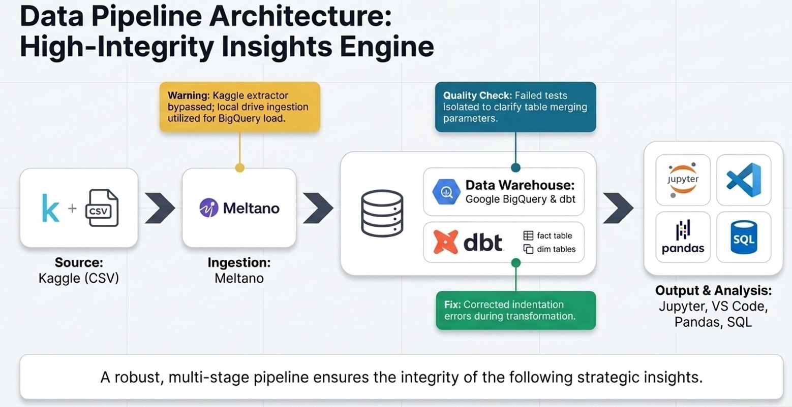

# OVERVIEW
This is a NTU DSAI Module 2 project that demonstrates the use of dbt and Meltano for data ingestion and transformation. The project involves ingesting the Olist dataset into BigQuery using Meltano, and then performing data transformations using dbt to create a star schema for analysis.

## Source Dataset
The dataset chosen is from the [Brazilian E-Commerce Public Dataset by Olist](https://www.kaggle.com/datasets/olistbr/brazilian-ecommerce), available on Kaggle. It contains information about orders, customers, products, and other related data from an e-commerce platform. The dataset is provided in CSV format and is dated from 2016-09-04 to 2018-08, which is very outdated. However, it is still useful for demonstrating the data pipeline and performing analysis on historical data.

## Business Case
The business case for this project is to analyze the customer distribution and sales performance of the e-commerce platform. The goal is to identify trends in customer behavior, segment customers based on their purchasing patterns, and provide insights for improving sales strategies. The analysis will focus on understanding who the most valuable customers are based on their purchasing behavior (Recency, Frequency, and Monetary value), and how to segment customers to tailor marketing strategies effectively.

## Project Structure
The project is structured as follows:
- `ingestion/`: Contains the Meltano project for data ingestion.
- `olist_dbt/`: Contains the dbt project for data transformation.
- `gx_test/`: Contains the Great Expectations project for data validation.
- `eda/`: Contains Jupyter notebooks for exploratory data analysis.
- `presentation/`: Contains the presentation slides and materials for the final presentation.
- `README.md`: This file, providing an overview of the project and instructions for setup and execution.

## Environment Setup
A conda environment was created with the following command:
```bash
conda env create --file proj-environment.yml    
```
This environment includes the necessary dependencies for both dbt and Meltano, as well as other libraries that may be useful for data analysis and visualization.

## Data Pipeline Overview


## Data Ingestion with Meltano
The data ingestion process involves setting up a Meltano project, configuring the tap to read the Olist dataset from a local directory, and configuring the target to load the data into BigQuery. 
Refer to the [README_meltano.md](ingestion/olist-ingestion/README_meltano.md) file for detailed instructions on setting up and running the Meltano project.

## Converting the `product_category_name` in the `products` table to English
The `product_category_name` column in the `products` table contains category names in Portuguese. To convert these category names to English, we can use the `product_category_name_translation` table, which contains the English translations of the category names. We can perform a LEFT JOIN between the `products` table and the `product_category_name_translation` table on the `product_category_name` column. The SQL query for can be found in the [sql_codes.md](eda/sql_codes.md) file.

## Data Transformation with dbt
The data transformation process involves setting up a dbt project, creating models to transform the ingested data into a star schema, and defining tests to ensure data quality. 
Refer to the [README_dbt.md](olist_dbt/README_dbt.md) file for detailed instructions on setting up and running the dbt project.

## Data Quality Check and Testing with Great Expectations
In this section, we will implement data quality checks using Great Expectations to ensure the integrity and reliability of our data. Refer to the [README_gx.md](gx_test/README_gx.md) file and [gx_testing.ipynb](gx_test/gx_testing.ipynb) notebook for detailed instructions on setting up and running the Great Expectations project.

## Exploratory Data Analysis (EDA)
After the data has been ingested and transformed, we can perform exploratory data analysis to gain insights into customer behavior and sales performance. The EDA will focus on analyzing customer distribution, sales revenue, and other relevant metrics to identify trends and patterns. Refer to the [EDA.ipynb](eda/EDA.ipynb) notebook for detailed analysis and visualizations.\
\
The presentation slides for the EDA can be found in the [presentation/DSAI_Mod2_Grp2.pdf](presentation/DSAI_Mod2_Grp2.pdf) file.


